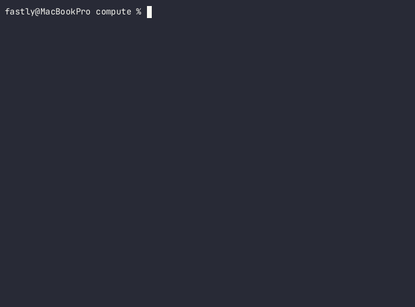

# @fastly/create-compute

An `npm create` script for interactively creating new JavaScript (TypeScript) applications for Fastly Compute.

```shell
npm create @fastly/compute
```

Follow the interactive prompts to select a directory, language, and starter kit, to create your Fastly Compute application in JavaScript or TypeScript.



> NOTE: `@fastly/create-compute` is provided as a Fastly Labs product. Visit the [Fastly Labs](https://www.fastlylabs.com/) site for terms of use.

## Usage

In its simplest form:

```shell
npm create @fastly/compute
```

You may also pass a number of command line options, in the form of `npm create @fastly/compute -- [<options>]`:

```
Options:
  --help                        - Displays a help screen.
  --directory=<pathspec>        - Specifies the directory to create the new
                                  application. If the directory exists, it must
                                  be empty. Defaults to the current directory.
  --author=<author-name>, ...   - Sets the author(s) in fastly.toml.
  --language=<lang>             - Used to select a category of starter kit.
                                  Can be 'javascript' or 'typescript'.
                                  Cannot be used with --from.
  --starter-kit=<id>            - Used to specify a starter kit. Must be used
                                  with --language, and cannot be used with
                                  --default-starter-kit or --from.
  --default-starter-kit         - Uses 'default' as the starter kit. Cannot be
                                  used with --starter-kit or --from.                               
  --from=<pathspec-or-url>      - Specifies a directory with a fastly.toml, a
                                  URL to a GitHub repo path with a fastly.toml,
                                  or a URL to a Fiddle, and will be used as the
                                  starting point of the new application. Cannot
                                  be used with --language or --starter-kit.
  --fastly-cli-path=<pathspec>  - Path to the fastly CLI command. If not
                                  specified, then it will be searched from the
                                  system path.
  --no-confirm                  - Do not show confirmation prompt before
                                  creating the application.
```

## Selecting a Starter Kit

After choosing a language (or specifying one via `--language`), you are prompted to select a starter kit. The initial list will contain a small selection of common starter kits. If you wish to pick from the full list of Fastly-provided Starter Kits for the selected language, select `Choose a starter kit from GitHub.`, and the tool will query GitHub for the widest selection.

## Specifying a template

By using the `--from` argument, or by selecting `Specify starter kit or directory` from the interactive prompts, you may specify an existing Compute JavaScript application to base your new application from. You may provide one of the following:

* A path to a local directory that contains a Compute program, e.g., `/path/to/existing/app`.
* A direct URL to a GitHub repository of a [Fastly Compute Starter Kit](https://www.fastly.com/documentation/solutions/starters/javascript/).
* A URL to a Fastly Fiddle. This should take the form of `https://fiddle.fastly.dev/fiddle/<fiddle-id>`.

## Prerequisites:

* [Fastly CLI](https://developer.fastly.com/learning/tools/cli/), version >= 10.0.0
* [Node.js](https://nodejs.org/) >= 18

## Issues

If you encounter any non-security-related bug or unexpected behavior, please [file an issue][bug]
using the bug report template.

[bug]: https://github.com/fastly/create-compute-js/issues/new?labels=bug

### Security issues

Please see our [SECURITY.md](./SECURITY.md) for guidance on reporting security-related issues.

## License

[MIT](./LICENSE).
